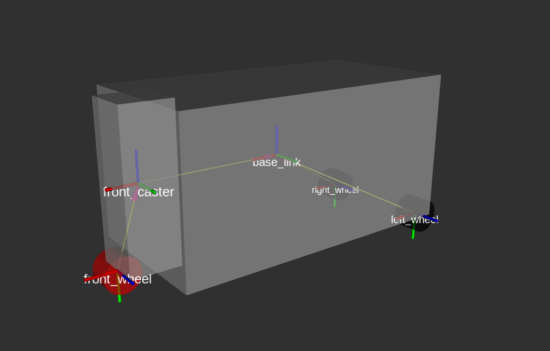
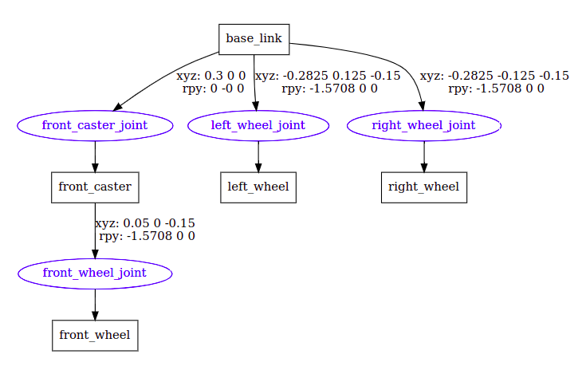

# Lab

- [Lab](#lab)
  - [TortoiseBot](#tortoisebot)
    - [Oczekiwania](#oczekiwania)
    - [Rzeczywistość](#rzeczywistość)
  - [The Construct](#the-construct)
  - [Workspace](#workspace)
  - [Package](#package)
  - [Planownaie nowego robota](#planownaie-nowego-robota)
  - [Hardware Interface](#hardware-interface)
  - [tf](#tf)
  - [roslaunch](#roslaunch)
  - [Messages](#messages)
  - [Model](#model)
    - [1. base\_link](#1-base_link)
    - [2. Przednie koło](#2-przednie-koło)
    - [3. Tylne koła](#3-tylne-koła)
    - [4. Przygotowanie do symulacji w Gazebo](#4-przygotowanie-do-symulacji-w-gazebo)
      - [Kolizje](#kolizje)
      - [Momenty bezwładności](#momenty-bezwładności)
    - [differential\_drive\_controller](#differential_drive_controller)
  - [roslaunch](#roslaunch-1)
  - [teleop\_twist\_keyboard](#teleop_twist_keyboard)

## TortoiseBot

### Oczekiwania

Czyli prawdziwy i ładny model robota.


### Rzeczywistość

Czyli prosty przykład edukacyjny z dwoma tylnymi napętami i obrotowym pasywnym kołem z przodu.



## The Construct

Tworzymy nowy pusty ROSject na platformie [The Construct](https://www.theconstructsim.com/), wersja ROS Noetic.

## Workspace

**Kompletny workspace z zajęć znajduje się w katalogu tortoisebot_ws.**

Tworzymy nowy workspace lub korzystamy z obecnie dostępnego (np. `catkin_ws`):

```sh
mkdir -p tortoisebot_ws/src
cd tortoisebot_ws
catkin_make
```

## Package

**Wszystkie paczki w naszym projekcie powinny znajdować się w katalogu `<nazwa workspace'a>/src/...`.** Tworzymy nową paczkę `tortoisebot`:

```sh
catkin_create_pkg tortoisebot rospy std_msgs actionlib_msgs message_generation
```

Następnie przechodzimy do katalogu głownego i wpisujemy\*:

```sh
catkin_make
source ./devel/setup.bash
```

\* Zamiast `setup.bash` możemy wykonać inny skrypt np. `setup.sh`, `setup.zsh` w zależności od naszego interpretera.

## Planownaie nowego robota

- Decyzja o wykorzystywnaiu ROS'a.
- Niskopoziomowe oprogramowanie do sterowania silnikami.
- Modelu struktury fizycznej robota.
- Rozszerzony model z parametrami fizycznymi (w celu jego symulacji).
- Sensory.
- Algorytmy.

## Hardware Interface

W prawdzimym robocie musielibyśmy zaimplementować niskopoziomowy interfejs do obsługi silników. Jest to bardzo zależne od sprzetu jaki posiadamy. Na potrzeby tego kursu pomijamy ten punkt i będziemy korzystać tylko z symulacji Gazebo.

## tf

Package, który dostarcza odpowiedzi na pytania takie jak:

- _Jakie było położenie względem siebie dwóch układów 5 sekund temu?_
- _Jaka jest pozycja obiektu w chwytaku manipulatora względem danego układu?_
- _Jaka jest aktualna pozycja danego układu względem układu mapy?_


## roslaunch

ROS'owy `launch` to plik pozwalający na uruchamianie wielu nodów oraz ich konfiguracji za pomocą jednego polecenia:

```sh
roslaunch package_name file.launch
```

Wykorzystywane są w tym celu pliki w formacie XML z rozszerzeniem `.launch`. Przykładowy `launch`:

```xml
<launch>
  <!-- run main panorama node -->
  <node pkg="panorama" type="panorama.py" name="panorama" output="screen">
    <!-- remaps for each input -->
    <remap from="/cam_left" to="/panorama_dummy/cam_left/image_raw"/>
    <remap from="/cam_right" to="/panorama_dummy/cam_right/image_raw"/>
  </node>
</launch>
```

Często wykorzystywane tagi:

- `<node>`
- `<include>`
- `<remap>`
- `<env>`
- `<param>`
- `<group>`
- `<test>`
- `<arg>`

## Messages

Podczas pracy nad naszym robotem będziemy wykorzystywać standardowe message:

- `geometry_msgs/Twist`
  ```go
  geometry_msgs/Vector3 linear
    float64 x
    float64 y
    float64 z
  geometry_msgs/Vector3 angular
    float64 x
    float64 y
    float64 z
  ```
- `nav_msgs/Odometry`
  ```go
  std_msgs/Header header
    uint32 seq
    time stamp
    string frame_id
  string child_frame_id
  geometry_msgs/PoseWithCovariance pose
    geometry_msgs/Pose pose
      geometry_msgs/Point position
        float64 x
        float64 y
        float64 z
      geometry_msgs/Quaternion orientation
        float64 x
        float64 y
        float64 z
        float64 w
    float64[36] covariance
  geometry_msgs/TwistWithCovariance twist
    geometry_msgs/Twist twist
      geometry_msgs/Vector3 linear
        float64 x
        float64 y
        float64 z
      geometry_msgs/Vector3 angular
        float64 x
        float64 y
        float64 z
    float64[36] covariance
  ```

## Model

- URDF (Unified Robot Description Format)
  - `<link>` - Bryła sztywna.
  - `<joint>` - Łączy dwa link'i ze sobą, definuje rodzaj ruchu między nimi.

1. W paczce `tortoisebot` tworzymy katalog `urdf` (obok katalogu `src`).
2. Tworzymy w nim nowy plik `tortoisebot.urdf`.

### 1. base_link

Do `tortoisebot.urdf` wrzucamy prosty XML z jedną bryłą:

```xml
<?xml version="1.0"?>
<robot name="tortoisebot">
  <link name="base_link">
    <visual>
      <geometry>
        <box size="0.6 0.3 0.3"/>
      </geometry>
      <material name="silver">
        <color rgba="0.75 0.75 0.75 1"/>
      </material>
    </visual>
  </link>
</robot>
```

Korzystając z paczki `urdf_tutorial` możemy łatwo wyświetlić naszego URDF'a w RViz'ie:

```sh
roslaunch urdf_tutorial display.launch model:=tortoisebot.urdf
```

Możemy też wygenerować graf relacji pomiędzy link'ami i join'ami URDF'a:

```sh
urdf_to_graphiz tortoisebot.urdf
```

### 2. Przednie koło

1. Dodajemy link połaczony joint'em z base_link'iem. Kod wrzucamy tak, aby był dzieckiem `<robot> ... </robot>`, (`type="continuous"` definiuje w jaki sposób linki mogą się ruszać względem siebie, dostępnych jest oczywiście więcej typów):

   ```xml
   <link name="front_caster">
     <visual>
       <geometry>
         <box size="0.1 0.1 0.3"/>
       </geometry>
       <material name="silver"/>
     </visual>
   </link>

   <joint name="front_caster_joint" type="continuous">
     <axis xyz="0 0 1"/>
     <parent link="base_link"/>
     <child link="front_caster"/>
     <origin rpy="0 0 0" xyz="0.3 0 0"/>
   </joint>
   ```

2. Dodajemy przednie koło:

   ```xml
   <link name="front_wheel">
     <visual>
       <geometry>
         <cylinder length="0.05" radius="0.035"/>
       </geometry>
       <material name="black"/>
     </visual>
   </link>

   <joint name="front_wheel_joint" type="continuous">
     <axis xyz="0 0 1"/>
     <parent link="front_caster"/>
     <child link="front_wheel"/>
     <origin rpy="-1.5708 0 0" xyz="0.05 0 -.15"/>
   </joint>
   ```

3. Sprawdzamy w RViz'ie czy wszystko działa:

   ```sh
   roslaunch urdf_tutorial display.launch model:=tortoisebot.urdf
   ```

4. Dodając argument `gui:=True` możemy wyświetlić okienko pozwalające nam ręcznie ruszać join'ami:
   ```sh
   roslaunch urdf_tutorial display.launch model:=tortoisebot.urdf gui:=True
   ```

### 3. Tylne koła

3. Dodajemy link'i i join'y do tylnych kół w taki sposób, aby były dziećmi `<robot> ... </robot>`.

   ```xml
   <link name="right_wheel">
     <visual>
       <geometry>
         <cylinder length="0.05" radius="0.035"/>
       </geometry>
       <material name="black">
         <color rgba="0 0 0 1"/>
       </material>
     </visual>
   </link>

   <joint name="right_wheel_joint" type="continuous">
     <axis xyz="0 0 1"/>
     <parent link="base_link"/>
     <child link="right_wheel"/>
     <origin rpy="-1.5708 0 0" xyz="-0.2825 -0.125 -.15"/>
   </joint>

   <link name="left_wheel">
     <visual>
       <geometry>
         <cylinder length="0.05" radius="0.035"/>
       </geometry>
         <material name="black"/>
     </visual>
   </link>

   <joint name="left_wheel_joint" type="continuous">
     <axis xyz="0 0 1"/>
     <parent link="base_link"/>
     <child link="left_wheel"/>
     <origin rpy="-1.5708 0 0" xyz="-0.2825 0.125 -.15"/>
   </joint>
   ```

1. Weryfikujamy czy wszystko ok:

   ```sh
   roslaunch urdf_tutorial display.launch model:=tortoisebot.urdf gui:=True
   ```

### 4. Przygotowanie do symulacji w Gazebo

#### Kolizje

Tag `<collision>` - rozmiar i kształt bryły dla wykrywanie kolizji w symulacji. Nie musi być tożsamy z `<visual>`.

1. Dodajemy kolizję dla `base_link` bazując na tagu `<visual>`.

   ```xml
    <collision>
      <geometry>
        <box size="0.6 0.3 0.3"/>
      </geometry>
    </collision>
   ```

   ostatecznie `base_link` powinien wyglądać tak:

   ```xml
   <link name="base_link">
     <visual>
       <geometry>
         <box size="0.6 0.3 0.3"/>
       </geometry>
       <material name="silver">
         <color rgba="0.75 0.75 0.75 1"/>
       </material>
     </visual>
     <collision>
       <geometry>
         <box size="0.6 0.3 0.3"/>
       </geometry>
     </collision>
   </link>
   ```

1. Dodajemy kolizję dla caster'a:

```xml
 <collision>
   <geometry>
     <box size="0.1 0.1 0.3"/>
   </geometry>
 </collision>
```

2. Na podstawie tagów `<visual>` definiujemy kolizje dla wszystkich 3 kół:
   - koło przednie:
     ```xml
       <collision>
         <geometry>
           <cylinder length="0.05" radius="0.035"/>
         </geometry>
       </collision>
     ```
   - koło lewe i prawe:
     ```xml
     <collision>
       <geometry>
         <cylinder length="0.05" radius="0.035"/>
       </geometry>
     </collision>
     ```

#### Momenty bezwładności

Tag `<inertial>` definiuje moment bezwładności bryły dla obliczeń symulacji fizycznych. [Przydatne wzory i obrazki](https://en.wikipedia.org/wiki/List_of_moments_of_inertia).

1. base_link:
   ```xml
   <inertial>
     <mass value="1.0"/>
     <inertia ixx="0.015" iyy="0.0375" izz="0.0375"
             ixy="0" ixz="0" iyz="0"/>
   </inertial>
   ```
2. caster:
   ```xml
    <inertial>
      <mass value="0.1"/>
      <inertia ixx="0.00083" iyy="0.00083" izz="0.000167"
              ixy="0" ixz="0" iyz="0"/>
    </inertial>
   ```
3. koło przednie:
   ```xml
    <inertial>
      <mass value="0.1"/>
      <inertia ixx="5.1458e-5" iyy="5.1458e-5" izz="6.125e-5"
              ixy="0" ixz="0" iyz="0"/>
    </inertial>
   ```
4. koła tylne:
   ```xml
   <inertial>
     <mass value="0.1"/>
     <inertia ixx="5.1458e-5" iyy="5.1458e-5" izz="6.125e-5"
             ixy="0" ixz="0" iyz="0"/>
   </inertial>
   ```

Możemy ponownie wygenerować graf relacji pomiędzy link'ami i join'ami URDF'a:

```sh
urdf_to_graphiz tortoisebot.urdf
```



### differential_drive_controller

Dodajemy `differential_drive_controller` plugin Gazebo, pozwalający na niskopoziomowe sterowanie kołami naszego robota. Gazebo zajmie się tłumaczeniem komend prędkości publikowanych na topic `/cmd_vel` na ruch robota.

```xml
<gazebo>
  <plugin name="differential_drive_controller"
          filename="libgazebo_ros_diff_drive.so">
    <leftJoint>left_wheel_joint</leftJoint>
    <rightJoint>right_wheel_joint</rightJoint>
    <robotBaseFrame>base_link</robotBaseFrame>
    <wheelSeparation>0.25</wheelSeparation>
    <wheelDiameter>0.07</wheelDiameter>
    <publishWheelJointState>true</publishWheelJointState>
  </plugin>
</gazebo>
```

## roslaunch

1. Tworzymy katalog `launch` w naszej paczce.
2. Dodajemy do niego plik `tortoisebot.launch`:

   ```xml
   <launch>
     <param name="robot_description"
           textfile="$(find tortoisebot)/urdf/tortoisebot.urdf" />

     <include file="$(find gazebo_ros)/launch/empty_world.launch"/>

     <node name="spawn_urdf"
           pkg="gazebo_ros"
           type="spawn_model"
           args="-param robot_description -urdf -model tortoisebot" />
   </launch>
   ```

3. Uruchamiamy launch:
   ```sh
   roslaunch tortoisebot tortoisebot.launch
   ```
4. Wyświetlona zostanie symulacja Gazebo.

## teleop_twist_keyboard

1. Aby sterować robotem możemy publikować na topic `/cmd_vel` wiadomości `geometry_msgs/Twist`.
2. Możemy skorzystać z dobrodziejstw paczki `teleop_twist_keyboard`, która implementuje sterowanie robotem za pomocą klawiatury. Node zbiera input od użytkownika i również publikuje na `/cmd_vel`:
   ```sh
   rosrun teleop_twist_keyboard teleop_twist_keyboard.py
   ```
